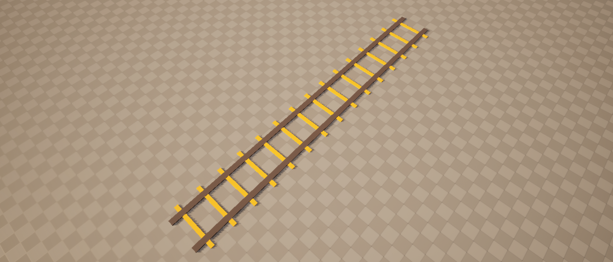
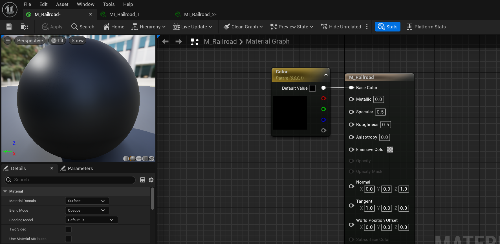
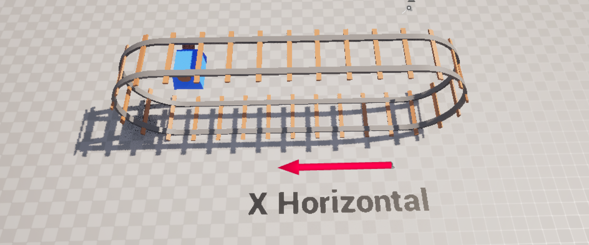

# Getting Started

In this section, we’ll walk through how to get started with the asset. First, let’s look at how to use the material functions to apply bending to any mesh. For this example, I’ll be using a railroad mesh along with a simple parent material. Material instances based on this parent will be used for the railroad segments.

<em>Railroad Mesh</em>

<em>Parent Material</em>

---

## Selecting the Material Function

1. Now that we have a mesh and a base material, let's select a shader to work with. For this example, I'll be using the *Runner* shader. Navigate to `WorldBendingToolkit/MaterialFunctions/RunnerFunctions`, select `MF_Runner` and drag it into the parent material's graph.

    

2. Next, create the required inputs as Material Parameters and wire them to `MF_Runner` accordingly. Let's also plug the `WPO` output from `MF_Runner` to the `World Position Offset` input of our Material.
    
    

3. You can now tweak various parameters to achieve the desired effect. Keep in mind that all material instances should use the same parameter values for consistent deformation. A detailed explanation of each parameter is available in the shader's dedicated section.

    

    !!! note
        If the **Y** BendAmount is not working, make sure to set the **MaxHeight** parameter to be a higher value.

---

## Understanding Forward and Up Axes

Most World Bending Shaders include a **Forward / Up Axis** input or variant. The Forward / Up axis is a Vector3 input that defines the *direction in which deformation is applied* by the shader.

Using the railroad mesh with `MF_Runner` as an example — since the mesh faces along the X axis, the appropriate forward axis for this shader would be **X**, or **1, 0, 0**.

If the mesh were rotated to face the Y axis, you’d need to update the `ForwardAxis` input accordingly — setting it to **0, 1, 0** to match the new direction. 

The easiest way to figure this out is to pick the **global** axis that aligns with the mesh’s **local** forward or up direction. 

The same approach applies to shaders with an **UpAxis** input—like the TinyPlanet shader that uses the `MF_TinyPlanet` material function. Since we want the effect to occur along the **Z** axis, we set the UpAxis input to **0, 0, 1.**

Again, if the mesh is rotated to face the **X** axis, we change the input accordingly.

### Axis Variants

Two shaders in this pack — **Inception** and **Spiral**—include their own fixed-axis variants rather than relying on input values. I separated them because their material graphs became too large and complex to support dynamic axis calculations efficiently. That said, the core functionality remains the same—just choose the material function that matches your desired facing direction.

<em>Mesh Facing X Axis</em>

<em>Parent Material Using X Varaint of the Inception Shader</em>

---

## Normals

All World Bending Shaders include dynamic normals that update alongside vertex deformations. This ensures lighting is maintained and prevents visual artifacts.

<em>Lit Colored Material</em>

<em>Unlit Normal Debug</em>

To enable dynamic normals, first disable **Tangent Space Normals** in your material settings. After that, connect the material function’s `Normal` output to the material’s normal input.

### Limitations

While normals generally work well on most meshes, Landscapes are an exception. This is mainly because the `VertexInterpolator` node—used for normal calculation—doesn't function properly with landscapes. Computing normals in the pixel shader is often inefficient and not ideal. So, whenever possible, avoid using landscapes and stick to static meshes, as demonstrated in the demo games. 

{width=80%}

If you need to remove the `VertexInterpolator`, just open the material function you're using and disconnect the `VertexInterpolator` node. Then, plug the `Normalize` node directly into the **Normal** reroute.

---

## Material Parameter Collections

If you've been following along, you may have noticed an inconvenient part of the workflow—manually setting the same parameter values across multiple material instances. Fortunately, this can be mitigated by using a **Material Parameter Collection (MPC)**. **MPCs** let you control shared parameters from a single interface, automatically applying them to any materials that reference them.

1. To create an MPC, simply right-click in the Content Browser, go to the *Materials* category, and select **Material Parameter Collection**.

    

2. Inside your **MPC**, add the parameters required by the material function you're using. For example, here I'm using `MF_Runner`.

    

3. Next, in your parent material, replace the existing scalar and vector parameters with your new **MPC** values. To do this, right-click in the graph, search for *Collection Parameter*, and select `CollectionParameter`.
    
    

4. In the Details panel, assign your newly created **MPC** and choose the appropriate parameter from the list.

    
    
    

    !!! note
        Material Parameter Collections don't support booleans directly, but you can work around this by using a scalar parameter to act as a boolean—typically using values like 0 for false and 1 for true. Alternatively, if you don't need global control, you can simply use a regular boolean parameter inside individual material instances.

5. Voila! You can now control all your material instances at once using a single MPC.

    

---

## Mesh Guidelines

This section covers some recommended practices when preparing meshes for use with World Bending Shaders.

### 1. High Poly

Having a high vertex count in your meshes is essential for smooth bending and minimizing shading artifacts. Even when going for a low-poly look, it's important to include enough vertices to properly support deformation.

<em>High Poly (f) vs Low Poly (b)</em>

### 2. Avoid One Big Meshes

Avoid using a single large mesh to represent multiple scene elements. Instead, model and import each element separately. This approach improves culling efficiency and works better with Nanite. I learned this the hard way while working on the example scene for the **Inception** shader—since I couldn’t rebuild everything from scratch, I had to break the large mesh into manageable chunks. It’s far more effective to work with individual meshes.

<em>Inception Town mesh split into chunks</em>

### 3. Nanite or Nonite?

Nanite plays a significant role in this asset—so much so that I raised the minimum engine version to 5.2 specifically to access new Nanite features that are vital for WPO performance. That said, Nanite is just a tool, and not every setup benefits from it. In some cases, it may even hinder performance. The example levels included demonstrate where Nanite is used effectively and where it’s better left disabled. As a rule of thumb, avoid using Nanite for **large** deformations.

---

## Ready to World Bend!

You're now ready to start creating with **World Bending Shaders**. With the essentials covered, feel free to experiment and explore different shaders. In the chapters ahead, we’ll tackle more advanced topics like performance optimization and real transformations.

{width=60%}

---