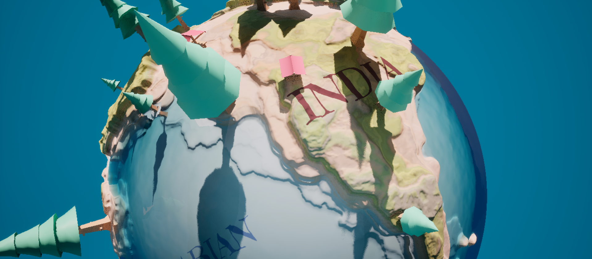

# Shaders

In this section, we'll cover each shader in detail along with its parameters.

## Tiny Planet 

This one’s my personal favorite—it creates the classic Tiny Planet effect on your meshes. It’s both simple and efficient. I recommend pivoting the effect around the camera or the player.

### Usage

Use the `MF_TinyPlanet` material function located in `WorldBendingToolkit/MaterialFunctions/TinyPlanetFunctions`.

{width=50%}

### Material Parameters

`Offset` - Offsets the effect of the curve. Higher value = flatter area around the pivot.

`BendAmount` - How big or small is the planet? Higher value = smaller planet.

`UpAxis` - Direction to bend the planet. Pick the local up axis of the mesh.

`Pivot` - Planet center, the location where the effect originates. Use CameraPos if you want a dynamic effect.

### Notes

This shader is Z deforming, as such `Max WPO Displacement` and `Bounds Scale` may need higher values, use mindfully.

---

## Cylinder

Similar to Tiny Planet, but this shader only bends one axis at a time. Useful for creating the *Horizon Bend* effect like that of Animal Crossing. I recommend pivoting the effect around the camera or the player.

### Usage

Use the `MF_Cylinder` material function located in `WorldBendingToolkit/MaterialFunctions/CylindricalFunctions`.

{width=60%}

### Material Parameters

`BendAmount` - How big or small is the cylinder? Higher value = smaller cylinder.

`Offset` - Offsets the effect of the curve. Higher value = flatter area near pivot.

`UpAxis` - Direction to bend the cylinder vertically. Pick the local up axis of the mesh.

`RotationAxis` - Axis of rotation. Only accepts X or Y.

`Pivot` - Cylinder center, the location where the effect originates. Use CameraPos if you want a dynamic effect.

### Notes

This shader is Z deforming, as such `Max WPO Displacement` and `Bounds Scale` may need higher values, use mindfully.

---

## Runner

Usually used in games like Subway Surfers to create the illusion of an endless level. I recommend pivoting the effect around the camera or the player.

### Usage

Use the `MF_Runner` material function located in `WorldBendingToolkit/MaterialFunctions/RunnerFunctions`.

{width=60%}

### Material Parameters

`Pivot` - Where the bend begins.

`BendAmount` - How big or small is the bend? Higher value = larger bends.

`bNegative` - Used to indicate if the mesh is facing the negative of an axis (e.g, -X or -Y).

`ForwardAxis` - Local forward of the mesh (i.e, the axis the mesh is facing).

`MaxHeight` - After what height to clip? Useful when dealing with landscapes. Default is 0 (i.e, no height).

`Offset` - Increases/decreases the distance between the bend and the pivot.

### Notes

This shader is Z deforming, as such `Max WPO Displacement` and `Bounds Scale` may need higher values, use mindfully.

---

## Twisted Spiral

Has similar properties to `MF_Runner` along with the capacity to twist in the forward axis. I recommend pivoting the effect around the camera or the player.

### Usage

Use the `MF_TwistedSpiral` material function located in `WorldBendingToolkit/MaterialFunctions/TwistedFunctions`.

{width=60%}

### Material Parameters

`Offset` - Increases/decreases the distance between the bend and the pivot.

`BendAmount` - How big or small is the bend? Higher value = larger bends. X controls twist.

`Smoothness` - Controls twist transition. Higher value = smoother transition.

`bNegative` - Used to indicate if the mesh is facing the negative of an axis (e.g, -X or -Y).

`ForwardAxis` - Local forward of the mesh (i.e, the axis the mesh is facing).

`Pivot` - Bend / spiral center.

### Notes

This shader is Z deforming, as such `Max WPO Displacement` and `Bounds Scale` may need higher values, use mindfully.

---

## Spiral

The Spiral shader comes in two main variants: **Vertical** and **Horizontal**. Each variant includes three axis-based sub-variants. The **Vertical** version allows you to spiral objects upward, while the **Horizontal** version creates a sideways spiral, similar to a loop-de-loop.

### Usage

For horizontal, use `MF_Spiral_Horizontal_X`, `MF_Spiral_Horizontal_Y` or `MF_Spiral_Horizontal_Z` located in `WorldBendingToolkit/MaterialFunctions/SpiralFunctions/Horizontal`. 

For vertical, use `MF_Spiral_Vertical_X`, `MF_Spiral_Vertical_Y` or `MF_Spiral_Vertical_Z` located in `WorldBendingToolkit/MaterialFunctions/SpiralFunctions/Vertical`.

{width=70%}

### Material Parameters

`SpiralCenter` - Center of spiral.

`BendAmount` - Bend angle in degrees.

`bNegative` - Used to indicate if the mesh is facing the negative of an axis (e.g, -X or -Y).

`BendRadius` - Radius of spiral.

`Pivot` - Spiral origin. Ideally the world location of mesh. 

### Notes

When moving the mesh, make sure both `SpiralCenter` and `Pivot` are adjusted accordingly. 

### Known Issues

When using small radii, you might notice *"stretching"* in the mesh. This happens because two vertices from the same mesh can end up on opposite sides of the center, causing them to bend in opposite directions.

To fix this, simply increase the `BendRadius` until the distortion is resolved.

{width=70%}

<em>Stretching in smaller radius</em>

{width=70%}

<em>Increased radius</em>

---

## Inception 

Inception is similar to spiral except it bends at both ends and has a `Rolloff` value. The Inception shader comes in two main variants: **Vertical** and **Horizontal**. Each variant includes two axis-based sub-variants.

### Usage

For horizontal, use `MF_Inception_Horizontal_X` or `MF_Inception_Horizontal_Y` located in `WorldBendingToolkit/MaterialFunctions/InceptionFunctions/Horizontal`. 

For vertical, use `MF_Inception_Vertical_X` or `MF_Inception_Vertical_Y` located in `WorldBendingToolkit/MaterialFunctions/InceptionFunctions/Vertical`.

{width=70%}

### Material Parameters

`BendCenter` - Center of spiral.

`BendAmount` - Bend angle in degrees.

`BendRadius` - Radius of spiral.

`Rolloff` - Offset distance before spiral begins.

`Pivot` - Spiral origin. Ideally the world location of mesh. 

### Notes

When moving the mesh, make sure both `BendCenter` and `Pivot` are adjusted accordingly. 

### Known Issues

When using small radii, you might notice *"stretching"* in the mesh. This happens because two vertices from the same mesh can end up on opposite sides of the center, causing them to bend in opposite directions.

To fix this, simply increase the `BendRadius` until the distortion is resolved.

{width=70%}

<em>Stretching in smaller radius</em>

{width=70%}

<em>Increased radius</em>
