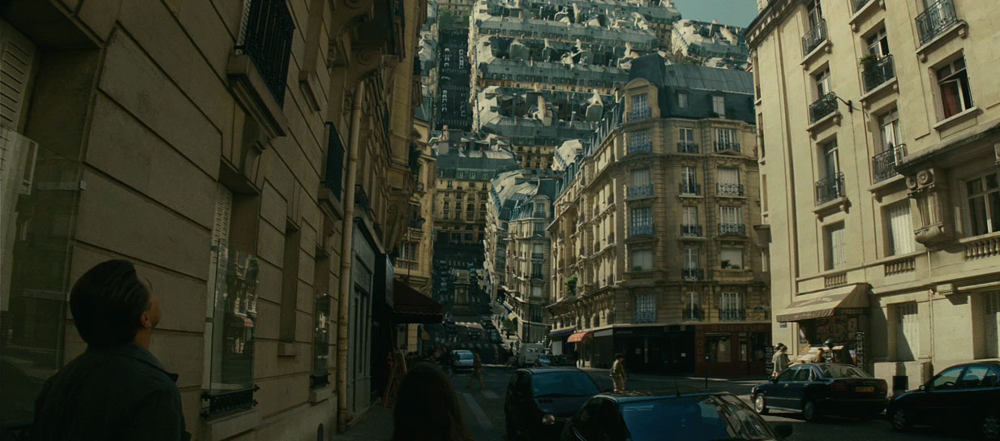

# Welcome to World Bending Docs!

**World Bending Shaders** is a shader pack featuring a collection of World Position Offset (WPO) material functions. These allow you to apply dynamic and visually striking deformations to your meshes. The pack also includes a Blueprint function library that lets you convert any world location into its vertex-deformed equivalent, enabling real transformations.

---

## Inspirations

This project was inspired by this scene from the movie [Inception](https://en.wikipedia.org/wiki/Inception). The way the entire town folds onto itself is pretty surreal, and I like surreal stuff. My second inspiration was this cool spiral [infographic](https://www.pinterest.com/pin/604889793740921077/) that I found on Pinterest.

---

## Use Cases

I originally created this asset to recreate the iconic city-bending scene from Inception, so it’s safe to say the project began with a focus on cinematics. Over time, however, it evolved to support gameplay elements as well. That said, there are certain limitations when it comes to runtime WPO operations, which I’ll cover in its own section.

---

## Types of Shaders

The pack consists of 8 main shaders, these are:

- **Tiny Planet** 
- **Cylindrical** 
- **Spiral**
- **Inception**
- **Runner** 
- **Twisted Spiral**
- **Balloon**
- **The Scream**

Each one of these will be covered in detail in their own section.

---

## Demo Games

If you're unsure whether this asset is right for you, feel free to try out the demo games. They’re essentially packaged versions of the example levels included with the asset. You can tweak deformation parameters in real-time and evaluate performance firsthand.

---